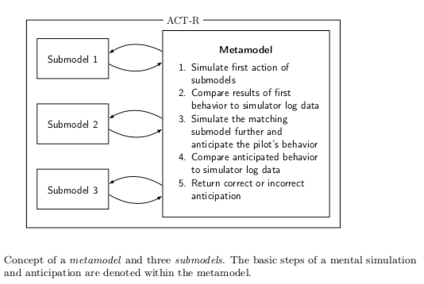

# ActMS - python interface

This is a library to enable mental simulation of multiple cognitive models within the Cognitive Architecture ACT-R.

ACT-MS (ACT-R Mental Simulation) is an implementation based on the Python dispatcher included in ACT-R Version 7.13, which facilitates the use of ACT-R commands within a Python environment and vice versa. ACT-MS incorporates multiple functions relevant to coordinate the simultaneous simulation of multiple ACT-R models. An exemplary use case can be found in the below publication [1].

Overall, the library contains methods to: 

- to forward and exchange parameters between the metamodel and the submodels.
- save the exchanged simulation parameters in a dictionary.
- enable utility learning over multiple ACT-R runs by saving the utility of one run respectively.


[1] <cite> new paper </cite> 




## Installation

```bash
pip install git+https://github.com/seblum/actms
```


## Quick-Start

Take a look at the [examples](examples) folder for an exemplary use case.


Call of the method <em>simulate-submodel</em> in a production of the metamodel to start the mental simulation of another specified ACT-R model <em>middle-model</em>.

```lisp

(p simulate-middle-submodel
  =goal>
    state           simulate-submodel
    action          =actionnumber
  =imaginal>
==>
  =imaginal>
  =goal>
    state           free
    action          =actionnumber
!eval! ("simulate-submodel" "middle-model" =actionnumber)
  )

```

Call of the method <em>return-from-submodel</em> in a production of the submodel to forward given parameters to the metamodel and save them within a specific slot of the imaginal chunk <em>resultactionone</em>.

```lisp

(P action-retour-1
   =goal>
     state          action-1
     action 		    1
   ?manual>   
     state          free
   =imaginal>
     response       =duration
==>
   +manual>              
     cmd      		  press-key     
     key      		  =duration
   -imaginal>
   =goal>
     state 			    idle
     action			    idle
!eval! ("return-from-submodel" =duration 1 "retrieve-action" "resultactionone")
  )

```

Initialization of ACT-MS. Saving the session number in the simulation results. Run of ACT-R model. Fetching the saved simulation / forwarded paramenters and saving them to a dataframe. Printing the dataframe.

```python
	
	import actms as ms
	session = 1

	ms.init_actms()
    ms.writeToProtocol("Session", session)

    actr.run_until_condition("end-program", True)       

    printer = ms.getProtocol()
	printer.to_csv('simulation_results.csv')

```

## Files

- **actms.py** - Contains the interface of ACT-MS and methods to load a user data set into the visicon of ACT-R.

- **actr.py** - Contains the dispatcher of ACT-R version 7.13., which is necessary to form a connection between python and ACT-R.


## Example

- **RUN-metamodel.py** 

- **EF-submodel-left.lisp**

- **EF-metamodel.lisp** 

## TODO
Possible additional feature to add:

- [ ] Add more dynamic and additional possibilites to save simulation parameters
- [ ] Add more dynamic read in for data
- [ ] Add debugging support 
